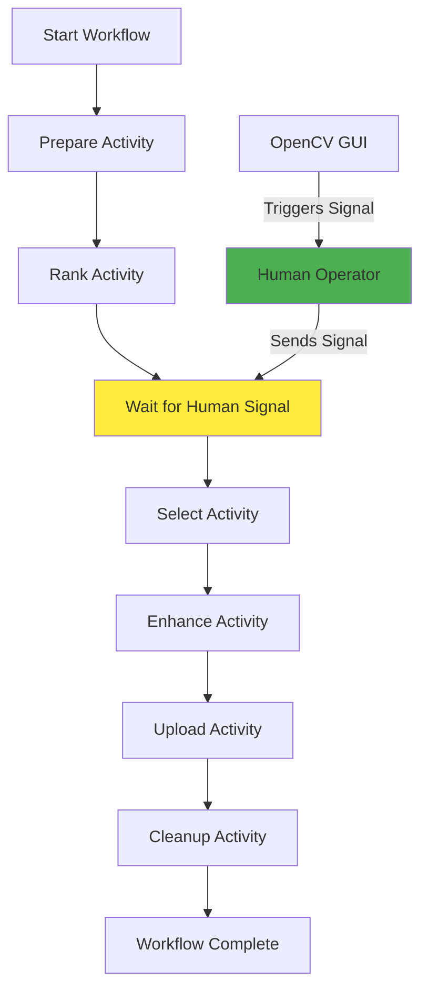
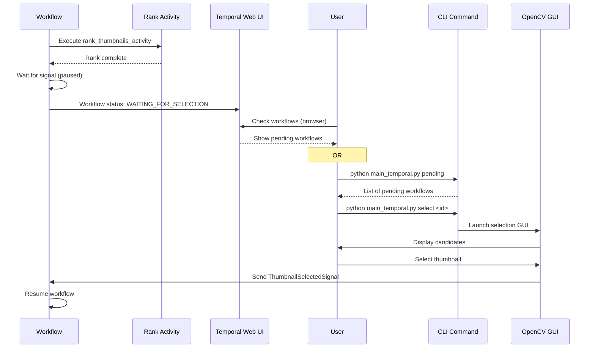

# Temporal Workflow Migration

Plan

## Overview

Transform the current sequential CLI-based workflow into a durable Temporal Workflow that orchestrates video processing stages as Activities. This provides automatic retries, failure recovery, observability, and proper handling of the human-in-the-loop selection step.

## Architecture




## User Notification Flow




## Implementation Steps

### 1. Setup Temporal Infrastructure

**Files to create:**

- `temporal/__init__.py` - Package initialization
- `temporal/worker.py` - Temporal Worker that runs Activities and Workflows
- `temporal/workflows.py` - Workflow definitions
- `temporal/activities.py` - Activity implementations (wrappers around existing functions)
- `temporal/signals.py` - Signal definitions for human-in-the-loop
- `temporal/client.py` - Temporal Client for starting workflows
- `docker-compose.yml` - Temporal Dev Server setup (optional, for local development)

**Dependencies to add:**

- Add `temporalio>=1.8.0` to `pyproject.toml`

**Configuration:**

- Add Temporal connection settings to `config.py` (Temporal server address, namespace)

### 2. Convert Stages to Activities

**Activity Wrappers** (`temporal/activities.py`):

- `prepare_video_activity(video_path: str)` - Wraps `video_prep.run()` logic for single video
- `rank_thumbnails_activity(video_path: str, top_n: int)` - Wraps `thumbnail_ranking.pipeline.rank_and_store_top_candidates()`
- `select_thumbnail_activity(video_path: str)` - Wraps `thumbnail_selector.select_thumbnail()` with signal integration
- `enhance_thumbnail_activity(video_path: str, template_name: str)` - Wraps `thumbnail_enhancement.renderer.run()`
- `upload_video_activity(video_path: str)` - Wraps `uploader.upload()` logic
- `cleanup_video_activity(video_path: str)` - Wraps `cleanup.cleanup_uploaded_videos()` for single video

**Key considerations:**

- Activities should be idempotent (safe to retry)
- Extract per-video logic from current batch-processing functions
- Activities should accept video paths as strings (Temporal serialization)
- Return results as simple types (strings, dicts, booleans)

### 3. Create Workflow Orchestration

**Workflow** (`temporal/workflows.py`):

- `process_video_workflow(video_path: str, top_n: int, template_name: str)` - Main workflow that:

1. Executes `prepare_video_activity`
2. Executes `rank_thumbnails_activity`
3. **Waits for human selection signal** (using `workflow.wait_condition`)
4. Executes `select_thumbnail_activity` (after signal received)
5. Executes `enhance_thumbnail_activity`
6. Executes `upload_video_activity`
7. Executes `cleanup_video_activity`

**Workflow features:**

- Use `@workflow.defn` decorator
- Implement retry policies for Activities
- Handle failures gracefully (continue with next video or fail workflow)
- Use `workflow.wait_condition` for human-in-the-loop step

### 4. Human-in-the-Loop Integration

**Signal Definition** (`temporal/signals.py`):

- `ThumbnailSelectedSignal` - Signal sent when human completes selection
- Contains: `video_path: str`, `selected_frame: str` (optional)

**Workflow Signal Handling:**

- Workflow waits for signal using `workflow.wait_condition(lambda: signal_received)`
- Signal handler sets flag to resume workflow
- Timeout handling (optional): cancel workflow if no signal received within X hours
- **Workflow Query**: Add `get_status_query()` to expose workflow state (e.g., "WAITING_FOR_SELECTION", "RANKING", "UPLOADING")

**User Notification - How to Know When Rank is Done:Primary Method: Temporal Web UI**

- Access Temporal Web UI (default: `http://localhost:8088` for dev server)
- View running workflows in the "Workflows" tab
- Workflows waiting for selection will show:
                                                                                                                                - Status: "Running" (workflow is active but paused)
                                                                                                                                - Current step visible in workflow history
                                                                                                                                - Filter/search by workflow type to find pending selections
- Click on workflow to see detailed execution history showing it's waiting at the selection step

**Secondary Method: CLI Command** (`main_temporal.py pending`):

- Query all workflows with status "WAITING_FOR_SELECTION"
- Display list of videos ready for selection:
  ```javascript
    Pending thumbnail selections:
            1. workflow_id: abc123 | video: md_HuyzVietvsThezLeo.mov
            2. workflow_id: def456 | video: ms_Player1vsPlayer2.mov
  ```


- Option to launch selection GUI: `python main_temporal.py select <workflow_id>`

**Selection Process:**

1. User checks Temporal Web UI or runs `python main_temporal.py pending`
2. User identifies workflow waiting for selection
3. User runs: `python main_temporal.py select <workflow_id>` OR manually runs selection GUI
4. Modified `thumbnail_selector.py`:

                                                                                                                                                                                                - Accepts workflow_id as parameter
                                                                                                                                                                                                - Opens existing OpenCV GUI for selection
                                                                                                                                                                                                - After user selects thumbnail, sends signal to workflow: `workflow_handle.signal(ThumbnailSelectedSignal, video_path, selected_frame)`
                                                                                                                                                                                                - Workflow resumes automatically

### 5. Refactor Existing Code

**Modify batch-processing functions to support per-video execution:**

- `video_prep.py`: Extract `prepare_single_video(video_path: Path)` from `run()`
- `thumbnail_ranking/pipeline.py`: Already has per-video function (`rank_and_store_top_candidates`)
- `thumbnail_selector.py`: Already per-video (`select_thumbnail`), add signal sending
- `thumbnail_enhancement/renderer.py`: Extract per-video logic if needed
- `uploader.py`: Extract `upload_single_video(video_path: Path)` from `run()`
- `cleanup.py`: Extract `cleanup_single_video(video_path: Path)` from `cleanup_uploaded_videos()`

### 6. Worker and Client Setup

**Worker** (`temporal/worker.py`):

- Create Temporal Worker that:
- Connects to Temporal server
- Registers all Activities and Workflows
- Runs in background (can be separate process/script)

**Client** (`temporal/client.py`):

- Create Temporal Client for:
- Starting workflows for each video
- Querying workflow status
- **Listing workflows waiting for selection** (search by workflow type and query status)
- Sending signals (for human-in-the-loop)
- Getting workflow handle by ID for signal sending

**New entry point** (`main_temporal.py`):

- Scan videos in `INPUT_DIR`
- Start a workflow for each video
- Provide CLI to:
- Start workflows: `python main_temporal.py start`
- Check status: `python main_temporal.py status <workflow_id>`
- **List pending selections**: `python main_temporal.py pending` (shows workflows waiting for human input)
- Trigger selection GUI: `python main_temporal.py select <workflow_id>`

### 7. Temporal Dev Server Setup

**Option A: Docker Compose** (`docker-compose.yml`):

- Include Temporal Dev Server service
- Include Temporal Web UI
- Easy local development

**Option B: Manual Installation:**

- Install Temporal CLI
- Run `temporal server start-dev` locally

### 8. Testing Strategy

**Unit Tests:**

- Test Activities in isolation
- Mock Temporal dependencies

**Integration Tests:**

- Test workflow execution with Temporal test framework
- Test signal handling

**Manual Testing:**

- Run Temporal Dev Server
- Start workflow for test video
- Verify human-in-the-loop signal flow

## File Structure

```javascript
cafe-badminton-uploader/
├── temporal/
│   ├── __init__.py
│   ├── workflows.py          # Workflow definitions
│   ├── activities.py          # Activity implementations
│   ├── signals.py             # Signal definitions
│   ├── worker.py              # Temporal Worker
│   └── client.py              # Temporal Client utilities
├── main_temporal.py           # New Temporal-based entry point
├── docker-compose.yml         # Temporal Dev Server (optional)
├── video_prep.py              # Modified: extract per-video logic
├── thumbnail_selector.py      # Modified: add signal sending
├── uploader.py                # Modified: extract per-video logic
├── cleanup.py                 # Modified: extract per-video logic
└── pyproject.toml            # Modified: add temporalio dependency
```


## Key Benefits

1. **Durability**: Workflows survive crashes and can resume
2. **Retries**: Automatic retry of failed Activities
3. **Observability**: Temporal UI shows workflow progress
4. **Human-in-the-Loop**: Proper async handling of manual steps
5. **Scalability**: Can process multiple videos concurrently
6. **Failure Recovery**: Resume from last successful step

## Migration Path

1. Keep existing `main.py` working (backward compatibility)
2. Implement Temporal version alongside
3. Test with single video first
4. Gradually migrate to full Temporal workflow
5. Eventually deprecate old CLI-based approach

## Next Steps After Implementation

1. Add workflow versioning for future changes
2. Implement workflow cancellation