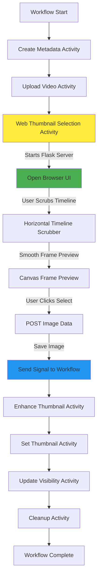

# Web-Based Thumbnail Selection Implementation

## Overview

Replace the current frame extraction and ranking workflow steps with a web-based thumbnail selector that opens a browser UI for interactive frame selection. The new activity will start a Flask server, serve the video, and provide a smooth horizontal timeline scrubber for navigating through frames. Users can smoothly scroll left/right through the entire video to find the perfect thumbnail frame, then select it to continue the workflow.

## Architecture Flow



## Implementation Details

### 1. Update Workflow (`temporal/workflows.py`)

**Changes:**

- Remove `WORKFLOW_STAGE_EXTRACTING_FRAMES` and `WORKFLOW_STAGE_RANKING_CANDIDATES` stages
- Remove `create_frame_candidates_activity` and `rank_candidates_activity` calls
- Add new `select_thumbnail_web_activity` after upload step
- Update stage progression to go directly from `UPLOADING` to `WAITING_FOR_SELECTION`

**Key modifications:**

```python
# After upload_video_activity:
self.stage = WORKFLOW_STAGE_WAITING_FOR_SELECTION
await workflow.execute_activity(
    select_thumbnail_web_activity,
    video_path,
    start_to_close_timeout=timedelta(hours=24),  # Long timeout for human interaction
)
```

### 2. Create Web Selection Activity (`temporal/activities.py`)

**New activity:**

- `select_thumbnail_web_activity(video_path: str, workflow_handle) -> None`
- Starts Flask server on fixed port (default: 8765, configurable via environment variable)
- Opens browser to the selection UI
- Waits for POST request with selected image data (base64 or binary)
- Saves image directly to `selected.jpg` (using existing `get_selected_candidate_path`)
- Sends signal to workflow
- Properly shuts down Flask server (clean shutdown, no resource leaks)

**Implementation approach:**

- Use Flask with a simple route structure
- Use `threading.Event` to wait for selection (blocking wait with timeout, e.g., 1 hour)
- Use `webbrowser` module to open browser
- **Frame extraction**: Client extracts frame to canvas and sends image data (base64 or binary) to server - no server-side OpenCV needed
- **Image saving**: Receive image data from POST request, decode if base64, save directly to `selected.jpg` file
- **Error handling**: If user closes browser without selecting (detected via timeout), raise `ApplicationError` with `non_retryable=False` so Temporal workflow can retry the activity later
- **Server management**: Use Flask's `app.run()` in a separate thread with `threading=True`, and implement shutdown via a shutdown endpoint or `werkzeug.serving.WSGIRequestHandler.shutdown()`
- Ensure all resources (server, threads) are properly cleaned up in finally block

### 3. Create Web UI Module (`web_selector/`)

**New directory structure:**

- `web_selector/__init__.py`
- `web_selector/server.py` - Flask server implementation
- `web_selector/templates/select.html` - HTML template with video player and frame selection UI

**UI/UX Design Philosophy:**

The interface prioritizes smooth, intuitive navigation for long videos (10+ minutes). Instead of clicking through frames one-by-one, users can:

- Drag a horizontal timeline scrubber smoothly left/right
- See frame preview update in real-time as they scrub
- Quickly navigate to any point in the video
- Select the current frame with a single click

This is similar to video editing software timeline scrubbing, optimized for thumbnail selection.

**Server routes:**

- `GET /` - Serve the selection UI
- `GET /video` - Serve video file directly using Flask's `send_file()` (simple, no streaming optimization)
- `GET /video/info` - Return video metadata (total frames, duration, fps) - optional, for UI display only
- `POST /select` - Receive selected image data (base64 encoded or binary), decode and save directly to `selected.jpg`, set event to unblock activity
- `POST /shutdown` (optional) - Graceful server shutdown endpoint for clean teardown

**HTML UI features:**

- HTML5 `<video>` element for video playback (hidden or minimized, used for frame extraction)
- Large canvas displaying the current frame preview
- **Horizontal timeline scrubber** - smooth scrollable slider for frame navigation
  - Draggable slider handle
  - Smooth scrubbing as user drags left/right
  - Visual timeline showing video progress
- Current frame number and timestamp display
- "Select This Frame" button (prominent, easy to click)
- Simple, clean styling with focus on the scrubber and frame preview

**Client-side JavaScript:**

- **Smooth timeline scrubbing**: 
  - Use `<input type="range">` slider or custom drag implementation
  - Update video position (`video.currentTime`) as user scrubs
  - Extract frame to canvas using `canvas.drawImage(video, ...)` at current video time
  - Throttle frame extraction for smooth performance (e.g., update every 50ms while dragging)
- **Client-side frame extraction**:
  - Use HTML5 video element's `currentTime` to seek to specific position
  - Draw current video frame to canvas for preview: `canvas.drawImage(video, 0, 0, canvas.width, canvas.height)`
  - Display current timestamp (optional, for user reference)
- Handle smooth scrubbing via mouse drag or touch gestures
- On "Select This Frame" button click:
  - Extract image data from canvas: `canvas.toDataURL('image/jpeg')` or `canvas.toBlob()`
  - Send POST request with image data (base64 string or FormData with blob)

### 4. Update Signal Handler (`temporal/workflows.py`)

**Modifications:**

- Keep existing `thumbnail_selected()` signal handler
- No changes needed - activity will save frame before signaling

### 5. Update Dependencies (`pyproject.toml`)

**Add:**

- `flask>=3.0.0` - Web framework

### 6. Remove/Update Old Code

**Files to modify:**

- `temporal/workflows.py` - Remove frame extraction and ranking activities
- `temporal/activities.py` - Keep old activities for backward compatibility or remove if not used elsewhere
- `main.py` - Update `cmd_select` command (may no longer be needed, or keep for manual trigger)
- `thumbnail_selector.py` - Keep for reference or remove if completely replaced

**Constants (`constants.py`):**

- Keep old stage constants for backward compatibility or remove if not referenced

### 7. Image Saving Logic

**In the activity:**

```python
def save_selected_image(image_data: str, output_path: Path) -> None:
    # If base64: decode and save
    # If binary: save directly
    # Save to selected.jpg path
```

**Note**: No OpenCV needed - client extracts frame to canvas and sends image data. Server just saves the received image.

## Technical Considerations

### 1. Port Management

- **Fixed port**: Use port `8765` by default (configurable via `THUMBNAIL_SELECTOR_PORT` environment variable)
- **Port conflict handling**: If port is in use, raise clear error message suggesting user close the conflicting process
- **Rationale**: Simpler than dynamic port discovery, and since this is per-activity (one at a time), conflicts should be rare

### 2. Server Shutdown

- **Flask's built-in server**: Use Flask's `app.run()` function with `threading=True` in a separate thread
- **Shutdown mechanism**: Implement graceful shutdown using one of these approaches:
  - Add a `/shutdown` endpoint that calls `werkzeug.serving.WSGIRequestHandler.shutdown()`
  - Use `threading.Event` to signal shutdown and check it in a background thread
  - Store server reference and call shutdown when selection is received or timeout occurs
- **Resource cleanup**: Ensure video file handles are closed, threads are joined, and server socket is properly closed
- **Implementation**: Run Flask server in a thread, wait for selection event, then trigger shutdown endpoint or use shutdown mechanism to stop server cleanly

### 3. Video File Serving

- **Simple approach**: Use Flask's `send_file(video_path)` for direct file serving
- **No streaming optimization**: Accept that large videos may take time to load - this is acceptable for local use
- **MIME type**: Set `mimetype='video/mp4'` or detect from file extension

### 4. Image Data Format

- **Client sends image**: Browser extracts frame to canvas and converts to image data
- **Format options**: 
  - Base64 encoded string (e.g., `data:image/jpeg;base64,...`)
  - Binary blob via FormData
- **Server handling**: Decode base64 or save binary directly to file
- **No frame accuracy concerns**: Client extracts exactly what user sees, so no positioning issues

### 5. Error Handling

- **Browser closed without selection**: 
  - Detect via timeout (e.g., 1 hour inactivity timeout)
  - Or detect when browser connection is lost and no selection received
  - Raise `ApplicationError` with `non_retryable=False` so Temporal workflow can retry the activity later
  - Error message should be clear: "Thumbnail selection cancelled or timed out"
- **Activity timeout**: The activity has `start_to_close_timeout=timedelta(hours=24)` - if this expires, Temporal will retry
- **Server startup failure**: If port is in use or server fails to start, raise `ApplicationError` immediately

### 6. Security

- **Local-only**: Server binds to `127.0.0.1` (localhost only), not `0.0.0.0`
- **Minimal validation**: 
  - Validate image data format (base64 or binary)
  - Basic size limits to prevent abuse (e.g., max 10MB)
- **No authentication**: Not needed for local-only access

#### 7. Activity-Workflow Communication

- **Workflow handle**: Activity needs access to workflow handle to send signal
- **Signal timing**: Signal should be sent AFTER frame is successfully saved to ensure workflow continues with valid frame
- **Implementation**: pass workflow handle as parameter to activity

#### 8. Browser Opening

- **Cross-platform**: `webbrowser.open()` should work on macOS, Linux, Windows
- **Browser selection**: Let OS default browser handle it
- **URL**: Open `http://127.0.0.1:8765/` (or configured port)

#### 9. Threading Model

- **Flask server thread**: Run Flask server using `app.run(threading=True)` in separate thread (non-daemon) so it doesn't block activity
- **Event waiting**: Use `threading.Event.wait(timeout=...)` in main activity thread to wait for selection
- **Clean shutdown**: When selection received or timeout, call shutdown endpoint or use shutdown mechanism, then join thread to ensure clean teardown

#### 10. Frame Extraction Performance

- **Client-side extraction only**: Use browser's HTML5 video + canvas to extract frames
  - Fast and simple - no server round-trips during scrubbing
  - Extract frame to canvas using `canvas.drawImage(video, ...)` at current video time
  - Update canvas preview in real-time as user scrubs timeline
- **Image transmission**: When user clicks "Select", extract image data from canvas and send to server
  - **Conversion methods**:
    - `canvas.toDataURL('image/jpeg')` → Returns base64-encoded string: `"data:image/jpeg;base64,/9j/4AAQ..."`
    - `canvas.toBlob(callback, 'image/jpeg')` → Returns binary Blob object
  - Both methods extract the pixel data from the canvas and encode it as image bytes (JPEG format)
  - POST request sends this image data (base64 string in JSON body, or binary blob in FormData)
  - Server receives image bytes and saves directly to `selected.jpg` - no OpenCV needed

## File Changes Summary

**New files:**

- `web_selector/__init__.py`
- `web_selector/server.py`
- `web_selector/templates/select.html`

**Modified files:**

- `temporal/workflows.py` - Remove frame/ranking steps, add web selection activity
- `temporal/activities.py` - Add `select_thumbnail_web_activity`
- `config.py` - Add `THUMBNAIL_SELECTOR_PORT` configuration (optional, defaults to 8765)
- `pyproject.toml` - Add Flask dependency

**Optional cleanup:**

- `thumbnail_selector.py` - May be deprecated but keep for now
- Remove unused imports from workflow file